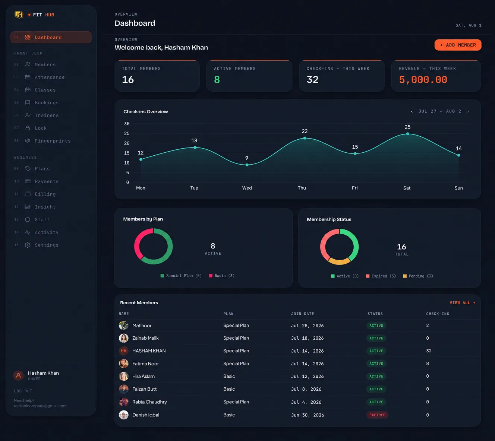
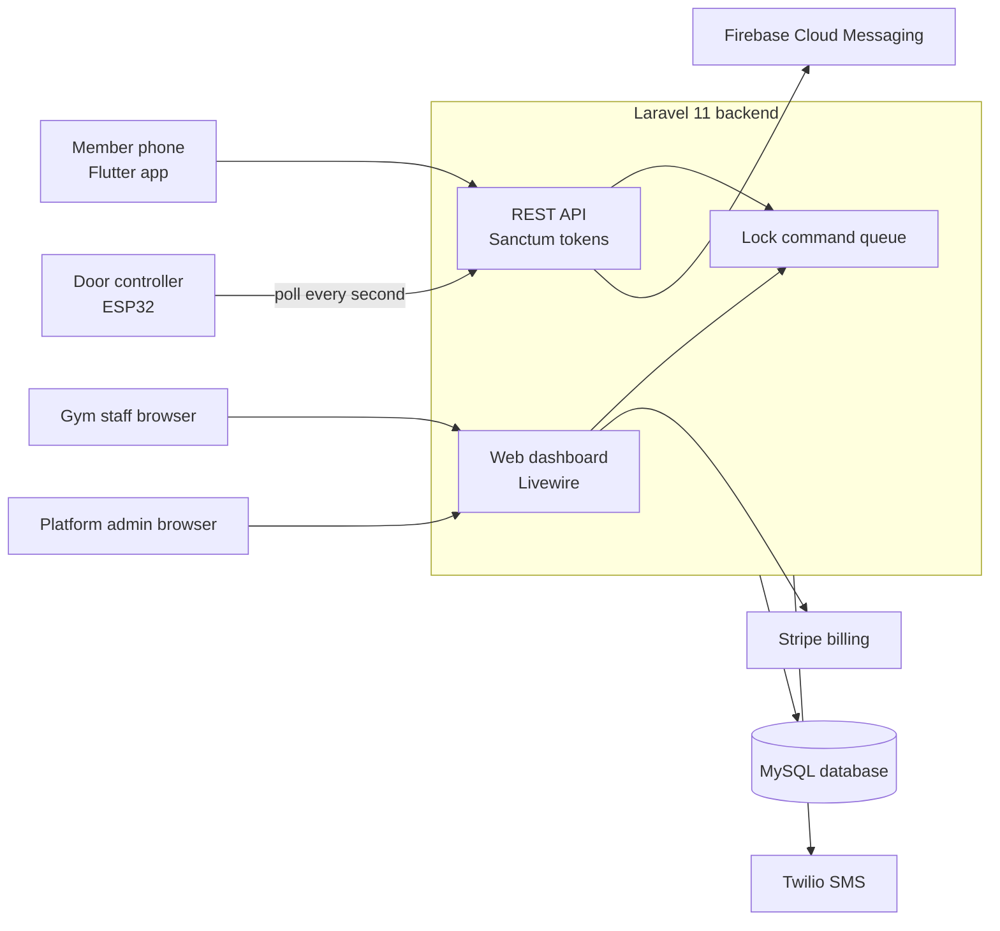
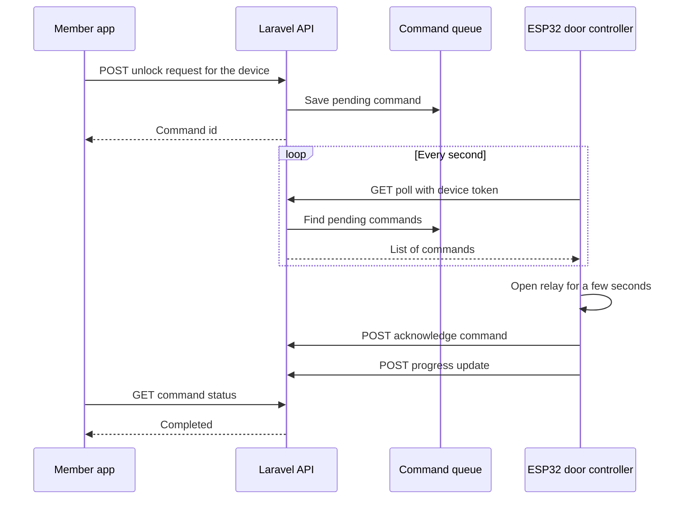
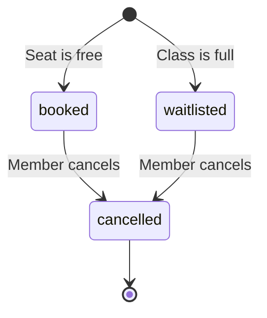
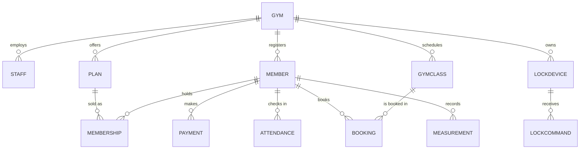
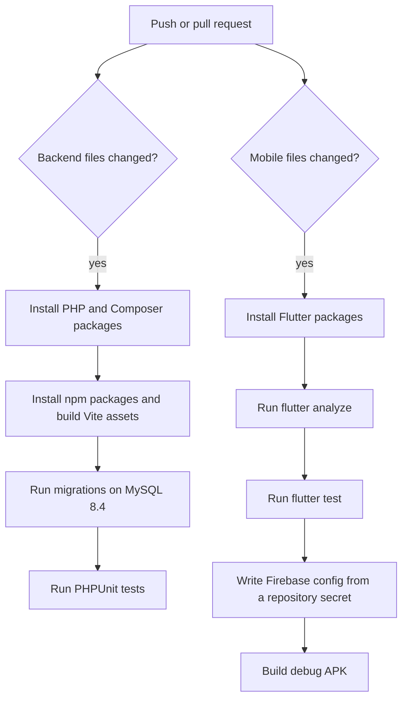

# FitHub

FitHub is a gym management system. Gym owners and staff manage their gym from a web dashboard. Members use a mobile app to check in, book classes and track their progress. A door controller built on an ESP32 board lets members open the gym door or a locker from their phone.

One FitHub installation can serve many gyms. Each gym has its own members, plans, classes, staff and door devices. The platform team has a separate admin panel to see all gyms in one place.

## Contents

* [Who uses FitHub](#who-uses-fithub)
* [Features](#features)
* [Repository scope](#repository-scope)
* [System architecture](#system-architecture)
* [How the door unlock works](#how-the-door-unlock-works)
* [Booking lifecycle](#booking-lifecycle)
* [Data model](#data-model)
* [Tech stack](#tech-stack)
* [Project structure](#project-structure)
* [Getting started](#getting-started)
* [Configuration](#configuration)
* [API overview](#api-overview)
* [Testing and CI](#testing-and-ci)
* [Deployment](#deployment)
* [Troubleshooting](#troubleshooting)
* [Security](#security)
* [Contributing](#contributing)
* [License](#license)

## Screenshots




## Who uses FitHub

* **Gym staff** manage members, plans, payments, classes, trainers, attendance and door devices from the dashboard.
* **Members** use the mobile app to see their plan, show a QR code, book classes and log body measurements.
* **Platform team** creates gyms, manages their accounts and watches activity across all gyms.
* **Door controllers** open locks when the backend asks them to, or when a member gives a valid fingerprint.

## Features

### Gym dashboard

* Member list with profile photo, member code and QR code
* Membership plans with prices and currency settings
* Membership freeze, renewal and expiry tracking
* Payments with printable receipts (PDF)
* Attendance log and check in by QR code
* Class schedule with bookings and waitlists
* Trainer accounts and trainer assignment for members
* Staff accounts with roles
* Lock device list with online status and unlock or lock buttons
* Insight page with gym activity summaries
* Activity log for staff actions
* Gym profile and receipt settings

### Member app

* Log in, forgot password and reset password with a one time code
* Home screen with plan, expiry date, payment status and personal QR code
* Browse classes, book a class, join a waitlist or cancel a booking
* Open the gym door from the app
* Log body measurements (weight, body fat, chest, waist, hips, arms and notes)
* Progress chart for weight over time
* Edit profile, change password and update profile photo
* Push notifications for reminders

### Platform admin

* Platform admin login separate from gym staff login
* Create gyms and view gym details
* Overview of all gyms and recent platform activity
* Subscription plans and Stripe billing for gyms

### Door access

* Member app unlock through the backend command queue
* ESP32 controller that polls the backend every second and opens a relay
* Fingerprint sensor for check in at the door
* Standalone office door controller with its own web admin, no backend needed

## Repository scope

This repository holds the whole project: the Laravel backend, the Flutter member app, the ESP32 door controller firmware, the GitHub Actions CI workflows and the deployment guide.

## System architecture



The door controller does not need an open port on the internet. It asks the backend for work, so the connection always starts from the device.

## How the door unlock works

When a member taps unlock in the app, the backend saves a command. The door controller picks it up on its next poll, opens the relay, and reports the result. The app checks the command status until it finishes.



Commands expire if the device is offline for too long. This stops an old unlock from running after the door comes back online.

## Booking lifecycle

A class booking has three states. If a class is full, the member goes on the waitlist.



## Data model

The main tables and how they connect:



Member and membership records use soft deletes, so deleted records can still be restored or audited.

## Tech stack

Backend
* PHP 8.3 and Laravel 11
* Livewire 4 and Alpine.js for the dashboards
* Laravel Sanctum for API tokens
* MySQL 8.4 for data
* Tailwind CSS, Vite and Chart.js for the front end

Mobile
* Flutter (Dart) for Android
* Riverpod for state management
* fl_chart for charts and flutter_svg for QR codes
* Firebase Cloud Messaging for push notifications

Door controllers
* ESP32 with the Arduino framework and PlatformIO
* ArduinoJson and Adafruit Fingerprint libraries

Services
* Twilio for SMS
* Stripe for gym billing
* Firebase Cloud Messaging for push
* Spatie Backup for nightly backups

## Project structure

```
FitHub/
├── backend/          Laravel app: API, dashboards, platform admin, console jobs
├── mobile/           Flutter member app
├── esp32-lock/       Door controller firmware with fingerprint check in
├── office-lock/      Standalone office door firmware
└── .github/          CI workflows for backend and mobile
```

## Getting started

### What you need

* PHP 8.2 or newer with the usual Laravel extensions (mbstring, dom, fileinfo, mysql, zip, gd)
* Composer 2
* Node.js 20 or newer and npm
* MySQL 8.x or MariaDB (Laragon works well on Windows)
* Flutter stable and the Android SDK for the mobile app
* PlatformIO for the door controller firmware

### Backend setup

1. Clone the repository and open the backend folder.

```bash
git clone https://github.com/hashamkhan11/FitHub.git
cd FitHub/backend
```

2. Install packages and create the environment file.

```bash
composer install
cp .env.example .env
php artisan key:generate
```

3. Open `.env` and set the database values (see [Configuration](#configuration)). Create an empty database first, then run:

```bash
php artisan migrate
```

4. Build the front end assets.

```bash
npm install
npm run build
```

5. Start the server.

```bash
php artisan serve --host=0.0.0.0 --port=8000
```

The dashboard is at `http://localhost:8000`. For live asset reloading while you develop, run `npm run dev` in a second terminal.

### Mobile app setup

1. Install packages.

```bash
cd mobile
flutter pub get
```

2. Add Firebase. Register an Android app in the Firebase console with the package name `com.ranksol.fithub_app`, then place the downloaded `google-services.json` at `mobile/android/app/google-services.json`. This file is ignored by Git and must never be committed.

3. Run the app and point it at your backend. The app calls `http://API_HOST:8080/api` for local development.

```bash
flutter run --dart-define=API_HOST=192.168.1.20 --dart-define=API_SCHEME=http
```

Use your computer's LAN address for `API_HOST`. On Windows you can find it with `ipconfig`. The phone must be on the same WiFi network.

4. Build a release APK for production. Pass your production API address so the app does not use the LAN default.

```bash
flutter build apk --release --dart-define=API_BASE_URL=https://your-domain.com/api
```

### Door controller setup

Each firmware project is a PlatformIO project.

```bash
cd esp32-lock
pio run -t upload
pio device monitor
```

The `esp32-lock` firmware needs the backend address and a device token. The device token is created in the dashboard on the Lock devices page. The `office-lock` firmware needs no backend. It is set up through its own web page. See [office-lock](https://github.com/hashamkhan11/FitHub/tree/main/office-lock).

## Configuration

The backend reads settings from `backend/.env`. These are the most important ones.

Application
* `APP_NAME`, `APP_ENV`, `APP_URL`, `APP_DEBUG`
* `APP_KEY` is created by `php artisan key:generate`. Do not reuse the key between environments.

Database
* `DB_CONNECTION`, `DB_HOST`, `DB_PORT`, `DB_DATABASE`, `DB_USERNAME`, `DB_PASSWORD`

Email
* `MAIL_MAILER`, `MAIL_HOST`, `MAIL_PORT`, `MAIL_USERNAME`, `MAIL_PASSWORD`, `MAIL_FROM_ADDRESS`, `MAIL_FROM_NAME`
* Use a transactional mail provider in production, not a personal email account.

SMS
* `TWILIO_SID`, `TWILIO_AUTH_TOKEN`, `TWILIO_FROM_NUMBER`

Billing and push
* `STRIPE_KEY`, `STRIPE_SECRET`, `STRIPE_WEBHOOK_SECRET`
* Firebase service account file at `backend/storage/app/firebase/service-account.json`. This file is ignored by Git.

Mobile app build settings
* `API_HOST` sets the LAN address used during development.
* `API_SCHEME` sets `http` or `https`. The default is `https`.
* `API_BASE_URL` sets the full API address for release builds.

## API overview

All member and staff API routes use the `/api` prefix. Routes that need a login use a Sanctum bearer token.

Authentication
* `POST /login` (rate limited)
* `POST /forgot-password` and `POST /reset-password` (rate limited)
* `POST /logout`

Member
* `GET /member` and `GET /member/qr`
* `GET /member/membership` and `GET /member/attendance`
* `GET` and `POST /member/measurements`
* `PUT /member/profile`, `POST /member/photo` and `POST /member/change-password`
* `POST /member/fcm-token`

Classes
* `GET /classes`
* `POST /classes/{class}/book`
* `POST /bookings/{booking}/cancel`

Door
* `GET /lock/devices`
* `POST /lock/devices/{device}/unlock` and `POST /lock/devices/{device}/lock`
* `GET /lock/commands/{command}/status`
* `GET /lock/poll`, `POST /lock/commands/{command}/ack` and `POST /lock/commands/{command}/progress` (called by the door controller with its device token in the `X-Device-Token` header)

Fingerprint and notifications
* `POST /fingerprint/scan`
* `GET /member/notifications` and notification read and delete routes

## Testing and CI

Run the backend tests locally:

```bash
cd backend
php artisan test
```

Run the mobile checks locally:

```bash
cd mobile
flutter analyze
flutter test
```

GitHub Actions runs these checks on every push and pull request.



Workflow files are in [.github/workflows](https://github.com/hashamkhan11/FitHub/tree/main/.github/workflows).

## Deployment

The production checklist is in [backend/DEPLOY.md](https://github.com/hashamkhan11/FitHub/blob/main/backend/DEPLOY.md). It covers:

* Running `composer install --no-dev`, migrations and cache commands on each deploy
* Adding the cron job for the Laravel scheduler (reminders and backups)
* Uploading the Firebase service account file
* Filling in the production `.env` values
* Registering the Stripe webhook endpoint
* Checking the site after each deploy

Do not commit `.env`, service account files or `google-services.json`.

## Troubleshooting

**The app cannot reach the backend**
* Check that the phone and computer are on the same WiFi network.
* Use the computer's LAN address, not `127.0.0.1`, on a physical phone.
* Allow the backend port through the Windows firewall.
* Use `API_SCHEME=http` for local development.

**The dashboard shows "Vite manifest not found"**
* Run `npm run build` in the `backend` folder.

**The Android build fails with "google-services.json is missing"**
* Place the Firebase file at `mobile/android/app/google-services.json`.

**Login says too many attempts**
* The login route allows 5 attempts per minute. Wait one minute and try again.

**A door shows as offline**
* Open the Lock devices page. The last seen time shows when the controller last polled.
* Check that the device token in the firmware matches the device.
* Check the WiFi signal and power supply of the controller.

## Security

* Passwords are hashed by Laravel.
* API tokens are issued by Sanctum. Door controllers use their own device tokens, stored only as hashes in the database.
* Login, password reset and door polling routes are rate limited.
* Gym accounts only work while their gym is active.
* Secrets (`.env`, Firebase service account, `google-services.json`, Stripe and Twilio keys) are never committed to the repository.
* Stripe webhook requests are checked with the signing secret.

To report a security problem, contact the repository owner privately. Do not open a public issue.

## Contributing

FitHub is a private project. Ask the repository owner before you make changes. When you have access, create a branch, keep commits small and describe what changed and why. Run the tests before you open a pull request.

## License

This is proprietary software. All rights are reserved. See [LICENSE](LICENSE) for the terms.

---

Built by [Hasham Mubarak](https://github.com/hashamkhan11).
